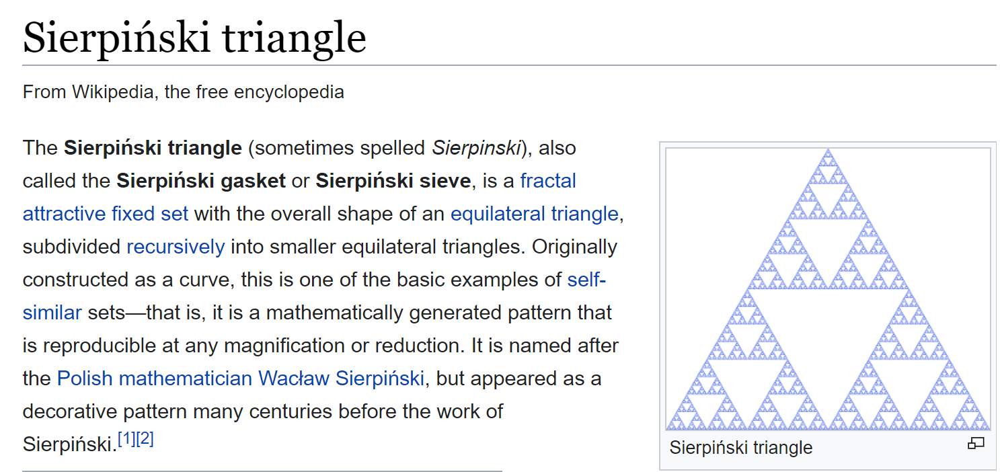

# Welcome to my Sierpinski experiment!

 </img>

## Goal
So, naturally my goal is to recreate the triangle
using a random algorithm.
Appearantly, it should work when I:
1. pick a random point in the triangle
2. draw a line to a random corner
3. pick half length of the line as new random point
4. draw a line again to a new random corner

Sounds doable in canvas, right?
Some JS should do the trick.

# Options
I think I can do it by drawing a neat rectangle using lines,
or work "pixelated" and replace the rectangle shape by a big amount of squares shaped like a... triangle.
The latter seems the easiest but I want to try the neat but harder way first.

